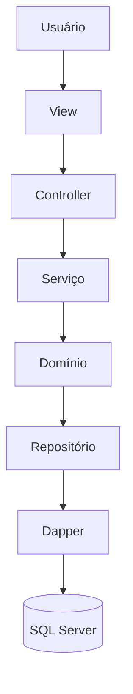
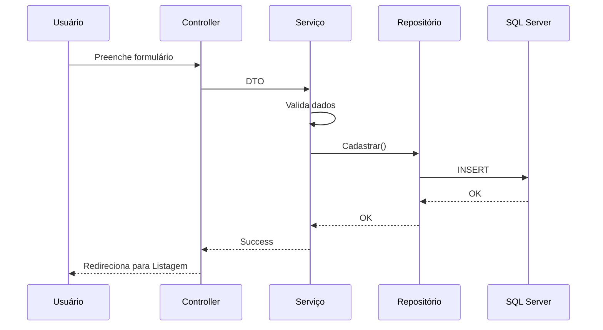
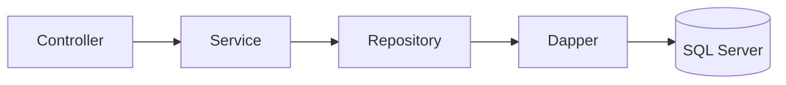
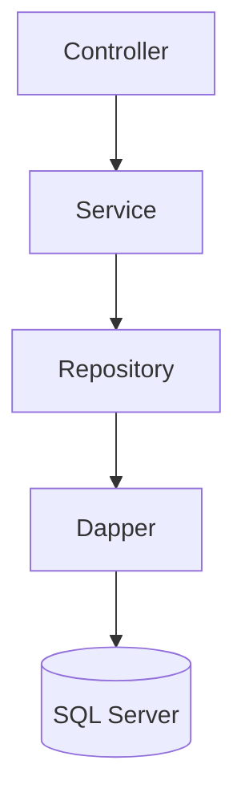

<!-- ====================================================== -->
<!--                    eAgenda Web                          -->
<!-- ====================================================== -->

<div align="center">

# 📅 eAgenda Web

### Sistema Web Completo para Gerenciamento de Contatos, Compromissos, Categorias, Despesas e Tarefas

<p>


</p>

<p align="center">
  
</p>

</div>

---

# 📖 Índice

- [📌 Sobre o Projeto](#-sobre-o-projeto)
- [🎯 Objetivos](#-objetivos)
- [✨ Funcionalidades](#-funcionalidades)
- [🏗 Arquitetura do Projeto](#-arquitetura-do-projeto)
- [🛠 Tecnologias Utilizadas](#-tecnologias-utilizadas)
- [📂 Estrutura do Projeto](#-estrutura-do-projeto)
- [🗄 Banco de Dados](#-banco-de-dados)
- [📊 Diagramas](#-diagramas)
- [⚙ Como Executar](#-como-executar)
- [☁ Deploy](#-deploy)
- [🚀 Melhorias Futuras](#-melhorias-futuras)
- [👨‍💻 Autor](#-autor)
- [📄 Licença](#-licença)

---

# 📌 Sobre o Projeto

O **eAgenda Web** é um sistema desenvolvido utilizando **ASP.NET Core MVC**, projetado para oferecer uma solução completa para organização pessoal e profissional.

A aplicação permite que o usuário gerencie diferentes informações do seu cotidiano em um único ambiente, reunindo funcionalidades de agenda, gerenciamento financeiro, cadastro de contatos e controle de tarefas.

Todo o projeto foi desenvolvido seguindo conceitos modernos de arquitetura de software, separando responsabilidades em camadas independentes e reutilizáveis, facilitando a manutenção, escalabilidade e evolução do sistema.

Além da organização em camadas, o projeto utiliza diversas bibliotecas modernas do ecossistema .NET para tornar o código mais limpo, desacoplado e de fácil manutenção.

---

# 🎯 Objetivos

O principal objetivo do projeto é fornecer uma aplicação web moderna para gerenciamento de informações pessoais.

Entre os principais objetivos destacam-se:

- organizar compromissos pessoais e profissionais;
- cadastrar contatos;
- controlar despesas;
- organizar categorias financeiras;
- gerenciar tarefas;
- aplicar boas práticas de desenvolvimento;
- utilizar arquitetura em camadas;
- demonstrar utilização de Dapper;
- utilizar AutoMapper;
- implementar Injeção de Dependência;
- aplicar validações de domínio;
- utilizar padrões modernos do ASP.NET Core MVC.

---

# ✨ Funcionalidades

O sistema é composto pelos seguintes módulos:

## 👤 Contatos

- Cadastro
- Consulta
- Edição
- Exclusão
- Associação com compromissos

---

## 📅 Compromissos

- Cadastro
- Alteração
- Exclusão
- Compromissos presenciais
- Compromissos remotos
- Associação com contatos
- Validação de conflitos de horário

---

## 🏷 Categorias

- Cadastro
- Alteração
- Exclusão
- Organização das despesas

---

## 💰 Despesas

- Cadastro
- Alteração
- Exclusão
- Associação com categorias

---

## ✅ Tarefas

- Cadastro
- Prioridades
- Percentual de conclusão
- Itens da tarefa
- Atualização automática do progresso

---

# ⭐ Principais Recursos

✔ Interface Web Responsiva

✔ Arquitetura em Camadas

✔ Repository Pattern

✔ DTOs

✔ ViewModels

✔ AutoMapper

✔ Dapper

✔ SQL Server

✔ FluentResults

✔ Serilog

✔ Bootstrap 5

✔ GitHub Actions

✔ Azure Web Apps

✔ Logging

✔ Injeção de Dependência

✔ Separação entre Domínio e Infraestrutura

✔ Validações de Domínio

✔ Tratamento centralizado de erros

---

# 🛠 Tecnologias Utilizadas

| Tecnologia | Finalidade |
|------------|------------|
| ASP.NET Core MVC | Framework Web |
| C# | Linguagem |
| SQL Server | Banco de Dados |
| Dapper | ORM |
| AutoMapper | Conversão entre DTOs e ViewModels |
| Bootstrap 5 | Interface |
| FluentResults | Tratamento de Resultados |
| Serilog | Logs |
| Azure Web Apps | Hospedagem |
| GitHub Actions | CI/CD |
| HTML5 | Interface |
| CSS3 | Estilização |
| JavaScript | Recursos do Front-End |

---

# 💡 Destaques Técnicos

Durante o desenvolvimento foram aplicados diversos conceitos importantes de Engenharia de Software.

Entre eles:

- Arquitetura em Camadas
- Separação de Responsabilidades
- Inversão de Dependência
- Injeção de Dependência
- Repository Pattern
- DTO Pattern
- ViewModel Pattern
- SOLID
- Clean Code
- Organização Modular
- Logging
- Validação de Entidades
- Tratamento de Erros
- Mapeamento Automático

---

# 📈 Visão Geral

O projeto foi estruturado para facilitar futuras expansões.

Novos módulos podem ser adicionados sem modificar a estrutura existente, mantendo o baixo acoplamento entre as camadas.

Essa organização torna o sistema altamente escalável e facilita a manutenção do código.

---

# 🏗 Arquitetura do Projeto

O **eAgenda Web** foi desenvolvido seguindo uma arquitetura em camadas (*Layered Architecture*), separando as responsabilidades de cada componente da aplicação.

Essa abordagem torna o código mais organizado, desacoplado, reutilizável e de fácil manutenção.

O fluxo da aplicação ocorre da seguinte forma:

```text
                    Usuário
                       │
                       ▼
               ASP.NET MVC Views
                       │
                       ▼
                 Controllers
                       │
                       ▼
                Camada Aplicação
                 (Serviços / DTOs)
                       │
                       ▼
                 Camada Domínio
             (Entidades e Regras)
                       │
                       ▼
              Camada Infraestrutura
                (Repositórios)
                       │
                       ▼
                    Dapper
                       │
                       ▼
                  SQL Server
```

---

# 📦 Organização do Projeto

O projeto foi dividido em dois grandes grupos:

```text
eAgendaWeb
│
├── Compartilhado
│
└── Modulos
```

Cada um possui responsabilidades bem definidas.

---

# 📂 Estrutura Completa

```text
eAgendaWeb
│
├── Compartilhado
│   │
│   ├── Aplicacao
│   │      ├── Logging
│   │      └── Injeção de Dependência
│   │
│   ├── Apresentacao
│   │      ├── Views Compartilhadas
│   │      ├── Extensions
│   │      ├── Home
│   │      └── AutoMapper
│   │
│   ├── Dominio
│   │      ├── EntidadeBase
│   │      └── Interfaces
│   │
│   └── Infra
│          ├── SQL
│          ├── Connection Factory
│          └── Injeção de Dependência
│
└── Modulos
       │
       ├── Contatos
       ├── Compromissos
       ├── Categorias
       ├── Despesas
       └── Tarefas
```

---

# 📚 Organização dos Módulos

Cada módulo segue exatamente a mesma arquitetura.

Exemplo:

```text
ModuloCategorias

│

├── Aplicacao

├── Apresentacao

├── Dominio

└── Infra
```

Essa padronização facilita bastante a manutenção do projeto.

Sempre que um novo módulo for criado, basta seguir a mesma estrutura.

---

# 🎯 Camada de Apresentação

A camada de apresentação representa tudo aquilo que possui contato direto com o usuário.

Ela é composta por:

- Controllers
- Views
- ViewModels
- AutoMapper
- Extensions

---

## Controllers

Os Controllers são responsáveis por:

- receber requisições HTTP;
- validar o ModelState;
- chamar os Serviços da aplicação;
- retornar Views;
- redirecionar páginas;
- tratar erros.

Exemplo do fluxo:

```text
Usuário

↓

CategoriasController

↓

ServicoCategoria

↓

RepositorioCategoria
```

Nenhuma regra de negócio permanece no Controller.

Toda regra fica centralizada na camada de Aplicação.

---

## Views

As Views foram desenvolvidas utilizando Razor Pages (.cshtml).

Cada módulo possui suas próprias Views.

Exemplo:

```text
Cadastrar

Editar

Excluir

Listar
```

Todas utilizam um Layout compartilhado.

---

## ViewModels

Os ViewModels são responsáveis pela comunicação entre as Views e os Controllers.

Eles possuem:

- validações;
- DataAnnotations;
- mensagens de erro;
- campos específicos para interface.

---

# 💼 Camada de Aplicação

A camada de aplicação contém toda a lógica da aplicação.

Ela faz a ponte entre os Controllers e o Domínio.

Essa camada é composta por:

```text
DTOs

↓

Serviços

↓

Validações

↓

Mapeamentos
```

---

## Serviços

Cada módulo possui um Serviço próprio.

Por exemplo:

```text
ServicoContato

ServicoCompromisso

ServicoCategoria

ServicoDespesa

ServicoTarefa
```

Esses serviços executam:

- validações;
- consultas;
- regras de negócio;
- persistência;
- tratamento de erros.

---

## DTOs

Os DTOs (Data Transfer Objects) evitam que a interface tenha acesso direto às entidades do domínio.

Exemplo:

```text
CadastrarCategoriaDto

EditarCategoriaDto

ListarCategoriaDto
```

Isso reduz o acoplamento do sistema.

---

# 🧠 Camada de Domínio

Esta é considerada a camada mais importante do projeto.

Ela contém:

- entidades;
- validações;
- regras de negócio;
- contratos.

Nenhuma dependência externa existe nessa camada.

---

## Entidades

Cada entidade representa uma tabela do banco.

Exemplos:

```text
Contato

Categoria

Compromisso

Despesa

Tarefa
```

Cada entidade é responsável por validar seus próprios dados.

Exemplo:

```text
Categoria

↓

Validar()

↓

Retorna lista de erros
```

---

## Entidade Base

Todas as entidades herdam de:

```text
EntidadeBase<T>
```

Ela fornece:

- Guid Version 7
- Atualizar()
- Validar()

Padronizando todas as entidades do sistema.

---

## Interfaces

Cada módulo possui uma interface de repositório.

Exemplo:

```text
IRepositorioCategoria

IRepositorioContato

IRepositorioCompromisso

IRepositorioDespesa

IRepositorioTarefa
```

Isso permite utilizar Injeção de Dependência e facilita testes futuros.

---

# 🗄 Camada de Infraestrutura

A camada de infraestrutura é responsável pelo acesso ao banco de dados.

Ela utiliza:

- SQL Server
- Dapper
- Connection Factory

---

## Repositórios

Cada repositório implementa uma interface do domínio.

Exemplo:

```text
RepositorioCategoria

↓

IRepositorioCategoria
```

Esse padrão reduz o acoplamento entre as camadas.

---

## Dapper

Ao invés de utilizar Entity Framework, o projeto utiliza Dapper.

Principais vantagens:

✔ Alta performance

✔ Controle total do SQL

✔ Consultas otimizadas

✔ Código simples

---

## SQL Connection Factory

A classe ConnectionFactory centraliza a criação das conexões.

Assim evita repetição de código.

Fluxo:

```text
Repository

↓

ConnectionFactory

↓

SqlConnection

↓

Banco
```

---

# 🔄 Fluxo Completo da Aplicação

O funcionamento do sistema pode ser representado pelo seguinte fluxo:



---

# 📌 Fluxo de uma Operação de Cadastro

Exemplo do cadastro de uma Categoria.



---

# 💉 Injeção de Dependência

Todo o projeto utiliza Injeção de Dependência nativa do ASP.NET Core.

Os serviços são registrados automaticamente.

Exemplo:

```text
Controller

↓

Service

↓

Repository

↓

ConnectionFactory
```

Esse padrão reduz fortemente o acoplamento do sistema.

---

# 📈 Benefícios da Arquitetura

A arquitetura utilizada oferece diversas vantagens.

Entre elas:

- Alta organização
- Fácil manutenção
- Reutilização de código
- Baixo acoplamento
- Separação de responsabilidades
- Escalabilidade
- Facilidade para testes
- Código mais limpo
- Melhor legibilidade
- Facilidade para adicionar novos módulos

---

# 🗄 Banco de Dados

O projeto utiliza o **Microsoft SQL Server** como Sistema Gerenciador de Banco de Dados (SGBD).

A persistência das informações é realizada através do **Dapper**, um Micro ORM que fornece alto desempenho e permite maior controle sobre as consultas SQL executadas pela aplicação.

Toda comunicação entre o sistema e o banco de dados ocorre por meio da camada de Infraestrutura, garantindo que as regras de negócio permaneçam desacopladas da persistência.

---

# 📌 Modelo de Persistência



---

# 📂 Entidades Persistidas

O banco de dados armazena as informações referentes aos principais módulos do sistema.

Entre eles:

| Entidade | Finalidade |
|----------|------------|
| Contatos | Armazenamento de pessoas cadastradas |
| Compromissos | Agenda de compromissos |
| Categorias | Organização das despesas |
| Despesas | Controle financeiro |
| Tarefas | Gerenciamento de tarefas |

---

# 🔄 Operações Realizadas

O sistema realiza operações completas de CRUD para todas as entidades.

As principais operações incluem:

- Inserção de registros
- Atualização
- Exclusão
- Consulta individual
- Consulta em lista
- Pesquisas por filtros

---

# 🔐 Integridade dos Dados

Antes que qualquer informação seja gravada no banco, diversas validações são executadas na camada de domínio.

Entre elas:

- Campos obrigatórios
- Formatos válidos
- Consistência dos dados
- Regras de negócio
- Evitar registros inválidos

Essa abordagem reduz significativamente a possibilidade de inconsistências no banco de dados.

---

# ⚡ Dapper

O projeto utiliza o **Dapper** como ferramenta de acesso a dados.

Entre as vantagens dessa escolha estão:

- Alto desempenho
- Baixo consumo de memória
- Controle total das consultas SQL
- Facilidade de manutenção
- Código simples e objetivo

O Dapper realiza o mapeamento entre os resultados das consultas SQL e os objetos da aplicação de forma leve e eficiente.

---

# 🔗 Connection Factory

A criação das conexões com o banco de dados é centralizada em uma **Connection Factory**.

Essa abordagem evita repetição de código e facilita futuras alterações na configuração da conexão.

Fluxo:

```text
Repository
      │
      ▼
ConnectionFactory
      │
      ▼
SqlConnection
      │
      ▼
SQL Server
```

---

# 📊 Relacionamento das Camadas



---

# 💾 Vantagens da Estrutura

A organização adotada oferece diversos benefícios:

- Separação entre regras de negócio e persistência
- Facilidade para manutenção
- Alta performance
- Reutilização de código
- Baixo acoplamento
- Escalabilidade
- Facilidade para testes

---

# 📚 Bibliotecas Utilizadas

Durante o desenvolvimento foram utilizadas diversas bibliotecas que simplificam o desenvolvimento e tornam o projeto mais organizado.

| Biblioteca | Finalidade |
|------------|------------|
| Dapper | Persistência de dados |
| AutoMapper | Conversão entre DTOs e ViewModels |
| FluentResults | Padronização de retornos |
| Serilog | Registro de logs |
| Bootstrap | Interface Responsiva |
| ASP.NET Core MVC | Framework Web |
| SQL Server | Banco de Dados |

---

## Dapper

Responsável pelo acesso aos dados da aplicação.

Principais vantagens:

- Alto desempenho
- Código enxuto
- Consultas SQL explícitas

---

## AutoMapper

Utilizado para converter automaticamente objetos entre diferentes camadas.

Exemplo:

```text
DTO

↓

ViewModel

↓

Entidade

↓

DTO
```

Isso reduz significativamente código repetitivo.

---

## FluentResults

Biblioteca utilizada para padronizar o retorno das operações.

Permite retornar:

- sucesso
- erro
- mensagens
- validações

de maneira organizada.

---

## Serilog

Responsável pelo sistema de logs da aplicação.

Permite registrar:

- Erros
- Informações
- Avisos
- Exceções

facilitando a manutenção do sistema.

---

## Bootstrap

Framework CSS utilizado para construção da interface.

Entre seus componentes utilizados estão:

- Navbar
- Cards
- Tabelas
- Botões
- Alertas
- Formulários
- Modais

Isso garante uma interface moderna e responsiva.

---

# ⚙️ Como Executar o Projeto

Siga os passos abaixo para executar o projeto em sua máquina.

## Pré-requisitos

Antes de iniciar, certifique-se de possuir os seguintes softwares instalados:

- .NET SDK 9.0 ou superior
- SQL Server
- Visual Studio 2022 (ou superior)
- Git

## Clonando o repositório

```bash
git clone https://github.com/SEU-USUARIO/eAgenda-Web.git
```

Entre na pasta do projeto:

```bash
cd eAgenda-Web
```

## Restaurando as dependências

```bash
dotnet restore
```

## Configurando o banco de dados

Configure a *Connection String* no arquivo:

```text
appsettings.json
```

apontando para a instância do SQL Server utilizada.

## Executando a aplicação

```bash
dotnet build

dotnet run
```

Após a execução, acesse a aplicação através do endereço informado no terminal (geralmente `https://localhost:xxxx`).

---

# 📁 Estrutura do Projeto

A organização do projeto segue uma arquitetura modular em camadas, separando responsabilidades e facilitando a manutenção.

```text
eAgenda-Web
│
├── Compartilhado
│   ├── Aplicacao
│   ├── Apresentacao
│   ├── Dominio
│   └── Infra
│
├── Modulos
│   ├── Categorias
│   ├── Compromissos
│   ├── Contatos
│   ├── Despesas
│   └── Tarefas
│
├── wwwroot
├── Program.cs
└── appsettings.json
```

---

# ☁️ Deploy

O projeto está preparado para implantação utilizando **GitHub Actions** e **Microsoft Azure Web Apps**.

Essa integração permite automatizar o processo de publicação da aplicação, garantindo maior agilidade e segurança nas atualizações.

---

# 🚀 Melhorias Futuras

Algumas funcionalidades que podem ser implementadas em versões futuras:

- Autenticação e autorização de usuários
- Dashboard com indicadores e gráficos
- API REST para integração com aplicações externas
- Containerização utilizando Docker
- Testes automatizados (unitários e de integração)
- Notificações por e-mail
- Integração com calendário (Google Calendar / Outlook)
- Exportação de relatórios em PDF e Excel

---

# 👨‍💻 Autor

**Gustavo Tessaro e Alec Luí**

Projeto desenvolvido como prática de desenvolvimento de aplicações web utilizando **ASP.NET Core MVC**, aplicando conceitos de arquitetura em camadas, boas práticas de programação e padrões modernos de desenvolvimento.

Caso tenha gostado do projeto, deixe uma ⭐ no repositório.

---

# 📄 Licença

Este projeto foi desenvolvido para fins acadêmicos e de estudo.

Sinta-se à vontade para utilizá-lo como referência, respeitando os créditos ao autor.

---

<div align="center">

## ⭐ Se este projeto foi útil para você, considere deixar uma estrela no repositório!

</div>
